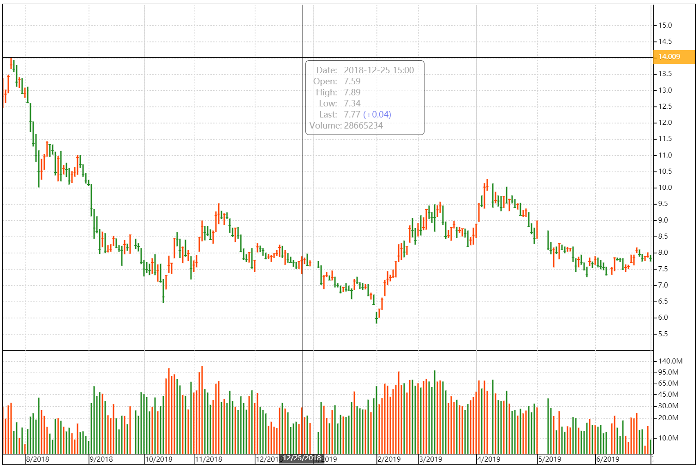

# Chart-Canvas
Chart-Canvas is a library, which can draw k-line chart, built with javascript and html5 canvas.

## Run
Execute command in root directory. [Node.js](https://nodejs.org) is required.
```bash
yarn install
yarn start
```

## Screenshot


## License
[The MIT License](LICENSE.md)